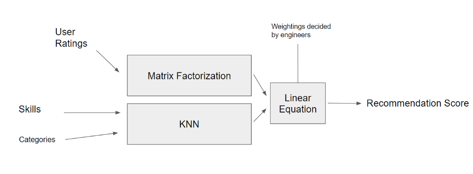

## Development

### IDE

We recommend using **Visual Studio 2022**.

### How to use

1. Run `dotnet tool restore` to install any necessary CLI tools.
2. Open `./BuddyRecommender/BuddyRecommender.sln` using Visual Studio.
3. Copy Data folder `./BuddyRecommender/Data` to `./BuddyRecommender/BuddyRecommender/bin/Debug/net6.0`.
4. Click the start button to run the program.
    - will train the model with data in `./BuddyRecommender/BuddyRecommender/bin/Debug/net6.0/Data/out-train.csv`.

### Update data

cd into data folder then,

```bash
  $ pip install -r requirements.txt
  $ python ./UpdateData.py
```

### Overview of Model

- Employs both collaborative and content based approaches:
    - 
    - Matrix factorization is a collaborative approach
    - KNN (K Nearest Neighbors) is a content based approach (coded in `Buddies.API/Services`)


